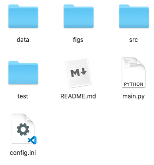
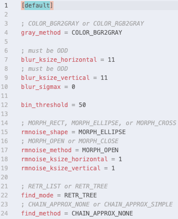
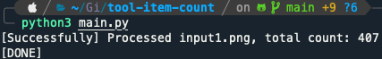
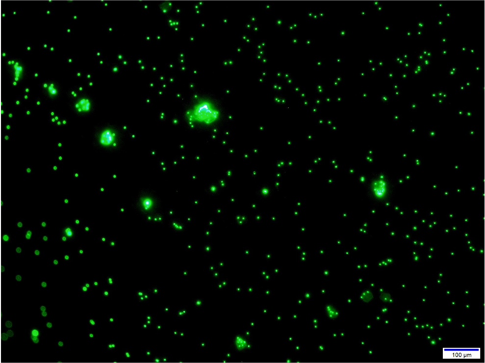
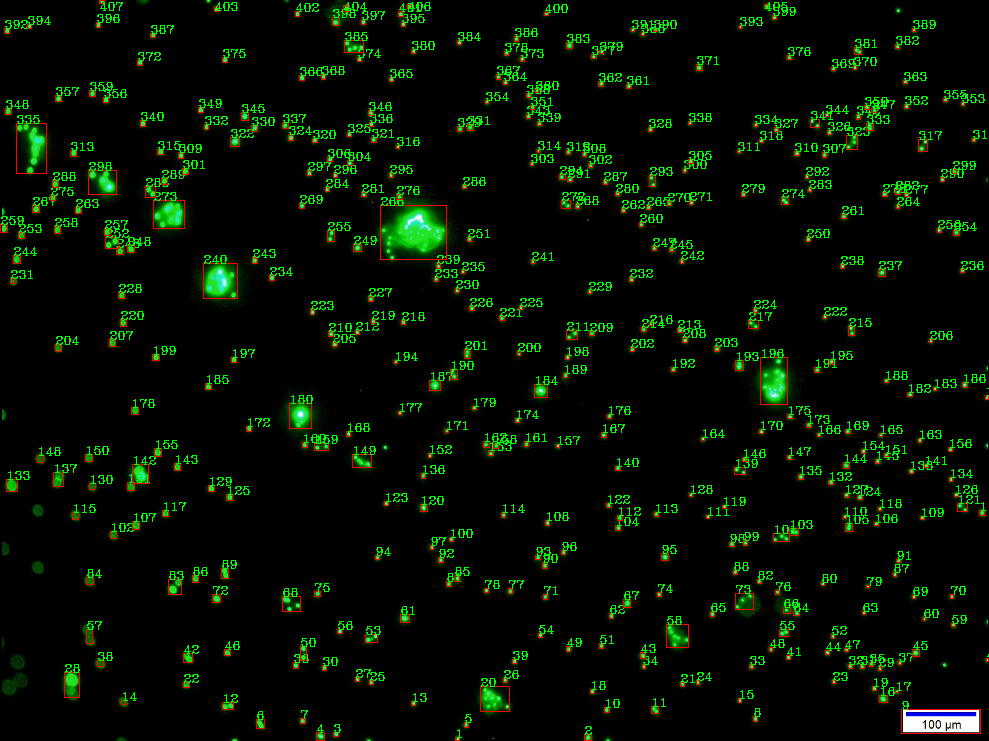

# 🔬 Item Count Tool 

This is a tool for counting items within an image based on OpenCV. 

## 🏷 Features

OpenCV Based Algorithm:

Item detection based on methods provided by [OpenCV](https://opencv.org/) package, include *image grayscale*, *image binarization*, *edge detector* and *drawing edges*. 

Easy to Use: 

Simple structure for using. Put image there, and run. 

Tutorial Provided:

If you want to understand how the tool runs, we provide an indetail tutorial in `test`. There are cases for each processing step, showing the performance, help you to know what to fix to get a better result.  

## ⚙️ Requirements

``` Python
Python Version: 3.6 or later
Python Packages: numpy, cv2, matplotlib
```

## 🔧 Structure

- `data`: images to be processed and results will be here 
- `figs`: figures for readme
- `src`: source code for tool
- `test`: test cases help users to understand how the tool running 

## 💾 How to use

**Step 1**. [Download](https://github.com/cbhua/tool-item-count/archive/main.zip) or [Clone](https://github.com/cbhua/tool-item-count.git) this repository.



**Step 2**. Put images to be processed in `/data/input`, support `.png` and `.jpg` files. 

**Step 3**. Change the parameters within `config.ini` if needed. We provided a series of tests within `/test/test.ipynb` to help you understand how the parameteres work. 



**Step 4**. Run `main.py` by `python3 main.py`, all images within input will be processed and results will be saved to `/data/output` with the same name of inputs. 



## 📊 Examples





